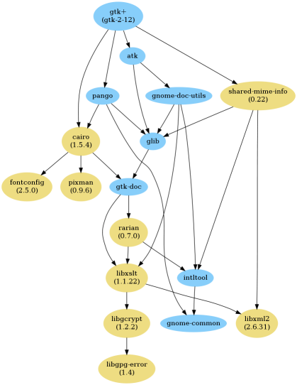

Command Reference
=================

JHBuild uses a command line syntax similar to tools like CVS:

::

    jhbuild [global-options] command [command-arguments]

The global JHBuild options are:

``-f``, ``--file`` <config>
   Use an alternative configuration file instead of the default
   ``~/.config/jhbuildrc``.

``-m``, ``--moduleset`` <moduleset>
   Use a module set other than the module set listed in the
   configuration file. This option can be a relative path if the module
   set is located in the JHBuild moduleset folder, or an absolute path
   if located elsewhere.

``--no-interact``
   Do not prompt the user for any input. This option is useful if
   leaving a build unattended, in order to ensure the build is not
   interrupted.

``--exit-on-error``
   Exit immediately if a module fails to build. This option is primarily
   useful in noninteractive mode, in order to ensure jhbuild does not
   continue to build any additional modules.

``--conditions``
   Modify the condition flags to be different than those determined on
   the basis of the OS and those specified in jhbuildrc. Modifications
   are specified like ``-wayland`` or ``+docs`` in order to remove or
   add conditions. Multiple modifications can be separated by a comma
   like ``--conditions=+docs,-wayland`` or you can split them across
   multiple ``--conditions`` arguments.

Additionally, JHBuild checks the presence, and value, of the following
environment variables:

.. envvar:: JHBUILD_RUN_AS_ROOT

   By default, JHBuild does not run when using the root user, to avoid
   destructive operations that may affect the whole system. In certain
   cases, though, it's acceptable to run JHBuild as root; for instance,
   inside a container, or in a continuous integration environment.
   Exporting the :envvar:`JHBUILD_RUN_AS_ROOT` will disable the user id check
   at startup.

Command specific options are listed below.

.. _bootstrap:

bootstrap
---------

The ``bootstrap`` command installs a set of build utilities. The build
utilities include autoconf, automake and similar utilities. The
recommended method to install the build utilities is via your
distribution's package management system. The ``bootstrap`` should only
be used if the build utilities are not provided by your distribution's
package management system, for example on ``Mac OS``.

The ``bootstrap`` command builds modules using the same method as the
``build`` command, but uses the ``bootstrap.modules`` moduleset.

See the :ref:`build` command documentation for available options.

.. _build:

build
-----

The ``build`` command builds one or more packages, including their
dependencies.

::

    jhbuild build [--autogen] [--clean] [--check] [--dist] [--distcheck] [--distclean] [--ignore-suggests] [--no-network] [--skip=module...] [--start-at=module] [--tags=tags] [-D date] [--no-xvfb] [--try-checkout] [--no-poison] [--force] [--build-optional-modules] [--min-age=time] [--nodeps] [module...]

If no module names are provided on the command line, the :ref:`modules`
list from the configuration file will be used.

``-a``, ``--autogen``
   Always run ``autogen.sh`` before building modules.

``-c``, ``--clean``
   Run ``make clean`` before building modules.

``--check``
   Run ``make check`` after building modules.

``-d``, ``--dist``
   Run ``make dist`` after building modules.

``--distcheck``
   Run ``make distcheck`` after building modules.

``--distclean``
   For git modules, run ``git clean -dfx`` before building modules. For
   other modules, run ``make distclean`` before building modules.

   .. note::

      This option will delete any uncommitted changes.

``--ignore-suggests``
   Do not build soft dependencies.

``-n``, ``--no-network``
   Do not access the network when building modules. This will skip
   download or update stages in a build. If a module can't be built
   without network access, the module build will fail.

``-s``, ``--skip``\ =<module,...>
   Do not build the listed modules. Used to skip the building of
   specified dependencies. ``fnmatch``-style globs are supported.

``--tags``\ =<tag,...>
   Ignore modules that do not match <tag>. Modules are automatically
   attributed a tag matching the name of the module's module set.

``-t``, ``--start-at``\ =<module>
   Start at the named module rather than at the beginning of the list.
   This option is useful if the build was interrupted.

``-D`` <date>
   If supported by the underlying version control system, update the
   source tree to the specified date before building. An ISO date format
   is required, e.g. ``"2009-09-18 02:32Z"``.

``-x``, ``--no-xvfb``
   Run graphical tests on the actual X server rather than in a simulated
   Xvfb.

``-C``, ``--try-checkout``
   If the build fails, and if supported by the version control system,
   force a checkout and run ``autogen.sh`` before retrying the build.

``-N``, ``--no-poison``
   If one or more of a module's dependencies failed, this option forces
   JHBuild to try to build the module anyway.

``-f``, ``--force``
   Build the modules even if policy states it is not required.

``--build-optional-modules``
   Modules listed as optional dependencies, may not be required to build
   the module. This option forces JHBuild to build optional
   dependencies.

``--min-age``\ =<time>
   Skip modules installed more recently than the specified relative
   time. The <time> string format is a number followed by a unit. The
   following units are supported: seconds (s), minutes (m), hours (h)
   and days (d). For example, ``--min-age=2h`` will skip modules built
   less than two hours ago.

``--nodeps``
   Ignore missing system dependencies. To ignore a single system
   dependency add the module to :ref:`skip`.

.. _make:

make
----

The ``make`` command is for actively developing on a particular module.
It requires the current directory be a source checkout, and does the
equivalent of ``buildone -nf $(basename $(pwd))``.

::

    jhbuild make [--clean] [--check] [--distcheck] [--quiet]

The options are the same as those available for the
:ref:`buildone` command.

.. _buildone:

buildone
--------

The ``buildone`` command is similar to ``build``, but it does not build
the dependent modules. It is useful for rebuilding one or more modules.

::

    jhbuild buildone [--autogen] [--clean] [--check] [--distcheck] [--distclean] [--no-network] [-D date] [--no-xvfb] [--force] [--min-age=time] [--nodeps] module...

The ``--autogen``, ``--check``, ``--clean``, ``-d``, ``--distcheck``,
``--distclean``, ``--no-network``, ``-D``, ``-x`` and ``--nodeps``
options are processed as per the :ref:`build` command.

At least one module must be listed on the command line.

.. _checkbranches:

checkbranches
-------------

The ``checkbranches`` checks the module's branches are defined correctly
within the version control system and the branches are consistent with
the module set.

::

    jhbuild checkbranches [--branch=branch...]

``--branch``\ =<branch>, ``-b`` <branch>
   The branch to check.

::

   $ jhbuild -m gnome-2.20 checkbranches
   libgnomecanvas is missing branch definition for gnome-2-20
   $

.. _clean:

clean
-----

The ``clean`` command cleans the build directories of one or more
modules.

::

    jhbuild clean [--skip=module...] [--start-at=module]

If no module names are provided on the command line, the
:ref:`modules` list from the configuration file will be
used.

See the :ref:`build` command documentation for a description of available options.

.. _dot:

dot
---

The ``dot`` command generates a file describing the directed graph
formed by the dependencies between a set of modules. This file can then
be processed using the `GraphViz <http://www.graphviz.org/>`__ software
to produce a diagram.

::

    jhbuild dot [--soft-deps] [--clusters] [module...]

If no module names are provided on the command line, the
`modules <#cfg-modules>`__ list from the configuration file will be
used.

The ``--soft-deps`` option adds dotted lines from the modules to the
soft dependencies. The ``--clusters`` option groups modules from
:ref:`metamodule`'s together.

The output of the dot command can be piped to the dot utility to
generate a PostScript file:

::

   $ jhbuild dot modules | dot -Tps > dependencies.ps

Or a PNG image:

::

   $ jhbuild dot modules | dot -Tpng > dependencies.png

   Sample JHBuild dot output

.. _gui:

gui
---

The ``gui`` command starts a graphical interface to JHBuild which can be
used to select modules to build and change some options.

::

    jhbuild gui

The graphical interface is rendered using GTK, so extra support
libraries are required.

.. _info:

info
----

The ``info`` command displays information about one or more modules.

::

    jhbuild info [--installed] [module...]

The command displays the module name, type, dependencies, dependent
packages, the source directory, and the time it was last installed with
JHBuild. If available, information specific to the module type such as
the CVS repository or download URL will also be displayed.

If there is no module specified the command will display information
about all the modules defined in the module set.

If the ``--installed`` option is specified, the output will be filtered
to include only installed packages. This resulting output only contains
modules that were actually built and installed by jhbuild. The output
does not include system dependencies.

.. note::

   If the ``--installed`` option is specified together with one or more
   module names, then only the installed modules (not including system
   dependencies) are printed out. If at least one module is not
   installed, then the command will exit with a return value of 1.

.. _list:

list
----

The ``list`` command displays the expanded list of modules the ``build``
command would build.

::

    jhbuild list [-a] [-r] [-s] [--start-at=module] [--tags=tags] [--ignore-suggests] [--list-optional-modules] [module...]

If no module names are provided on the command line, the
:ref:`modules` list from the configuration file will be
used.

The ``--skip``, ``--start-at``, ``--tags``, and ``--ignore-suggests``
options are processed as per the :ref:`build` command.

``-a``, ``--all-modules``
   List all the modules from the module set regardless of the build
   dependencies.

``-r``, ``--show-revision``
   If a module is set to a branch, show the branch name with the module
   name.

``--list-optional-modules``
   This option forces JHBuild to list optional dependencies.

.. _rdepends:

rdepends
--------

The ``rdepends`` command displays the reverse dependencies of a module.

::

    jhbuild rdepends [module]

``--dependencies``
   Show dependency path next to modules.

``--direct``
   Limit display to modules directly depending on specified module.

.. _run:

run
---

The ``run`` command runs the specified command using the same
environment that JHBuild uses when building modules.

::

    jhbuild run [--in-builddir] [--in-checkoutdir] program [argument...]

If using JHBuild to build GNOME, this command can be useful in X startup
scripts.

``--in-builddir``\ =<module>
   Run the command in the build directory of the specified module.

``--in-checkoutdir``\ =<module>
   Run the command in the source directory of the specified module.

.. _sanitycheck:

sanitycheck
-----------

The ``sanitycheck`` command performs a number of checks to verify the
build environment is okay.

::

    jhbuild sanitycheck

Some of the checks include:

-  The checkout and install prefixes are writable.

-  The required build tools are installed.

-  Some commonly used macros are available in the search paths of the
   ``aclocal`` commands associated with the various versions of
   ``automake``.

-  The XML catalog contains the DocBook DTD and stylesheets.

.. _shell:

shell
-----

The ``shell`` command starts the user's shell with the same environment
as JHBuild uses when building modules.

::

    jhbuild shell

This command is equivalent to the following:

::

   $ jhbuild run $SHELL

.. envvar:: UNDER_JHBUILD

The ``UNDER_JHBUILD`` environment variable will be set to "true" when
this shell is active. You can use the presence of that variable to
customize your shell's prompt to indicate that you indeed are under a
jhbuild-controlled shell. For example, you may want to put this in your
``.bashrc``:

::

       if [ -n "$UNDER_JHBUILD" ]; then
           PS1="[jhbuild] $PS1"
       fi

This will make your bash shell display ``[jhbuild]`` before your normal
prompt, making it easier to see which shells are under a jhbuild
environment.

.. _sysdeps:

sysdeps
-------
The ``sysdeps`` command displays, for the module names provided in the
command line (or if none are provided the :ref:`modules` list from the
configuration file will be used), the following three lists:

1. a list of installed system packages which will be used during the
   build. JHBuild will not build these modules and opt to use the system
   package instead.

2. a list of required packages. To begin a build the packages must be
   provided by your system.

3. a list of optional packages. The corresponding system package was not
   found or too old. JHBuild will build the module. Optional packages
   will not be displayed if :ref:`partial_build`
   is ``False``.

::

    jhbuild sysdeps [--dump] [--dump-all] [--install] [--assume-yes] [module...]

``--install``
   This option installs system packages which are dependencies of the
   moduleset. The installation method depends on your distribution.
   System packages are installed using PackageKit, if available. For
   distributions using APT such as ``Debian`` and ``Ubuntu``, this
   option requires apt-file to be installed.

   The user would have to confirm the list of packages about to be
   installed, unless the ``--assume-yes`` option is given.

``--dump``
   This option prints a machine readable list of missing sysdeps.

``--dump-all``
   This option prints a machine readable list of all missing sysdeps.

::

   $ jhbuild sysdeps
   System installed packages which are new enough:
     speex (speex.pc required=1.2rc1, installed=1.2rc1)
     lcms2 (lcms2.pc required=2.2, installed=2.2)
   ...
   Required packages:
     System installed packages which are too old:
       (none)
     No matching system package installed:
       zlib (zlib.pc required=1.2)
   Optional packages: (JHBuild will build the missing packages)
     System installed packages which are too old:
       WebKit (webkitgtk-3.0.pc required=1.5.1, installed=1.4.0)
       ...
     No matching system package installed:
       pulseaudio (libpulse.pc required=2.0)
       ...

.. _tinderbox:

tinderbox
---------

The ``tinderbox`` command is similar to ``build``, but writes all
terminal output to HTML files suitable for publishing on a website. It
can be used to set up systems similar to Mozilla's Tinderbox, or
Debian's Buildd.

::

    jhbuild tinderbox [--autogen] [--clean] [--distclean] [--no-network] [--output=directory] [--skip=module...] [--start-at=module] [-D date] [-C] [-N] [-f] [--nodeps] [module...]

The ``--autogen``, ``--clean``, ``--distclean``, ``--no-network``,
``--skip``, ``--start-at``, ``-D``, ``-C``, ``-N``, ``-f`` and
``--nodeps`` options are processed as per the :ref:`build` command.

``-o``, ``--output``\ =<directory>
   The directory to write the HTML files. JHBuild will create an index
   (``index.html``) and a HTML file for each module.

.. _uninstall:

uninstall
---------

The ``uninstall`` command uninstalls one or more modules.

::

    jhbuild uninstall module...

.. _update:

update
------

The ``update`` command is similar to ``build``, but only performs the
download or update stage for modules without building them.

::

    jhbuild update [--skip=module...] [--start-at=module] [--tags=tags] [--ignore-suggests] [-D date] [module...]

The ``--skip``, ``--start-at``, ``--tags``, ``--ignore-suggests`` and
``-D`` options are processed as per the :ref:`build` command.

.. _updateone:

updateone
---------

The ``updateone`` command is similar to ``update``, but it does not
update the dependent modules. It is useful for updating one or more
modules.

::

    jhbuild updateone [-D date] module...

The ``-D`` option is processed as per the :ref:`build` command.

At least one module must be listed on the command line.
